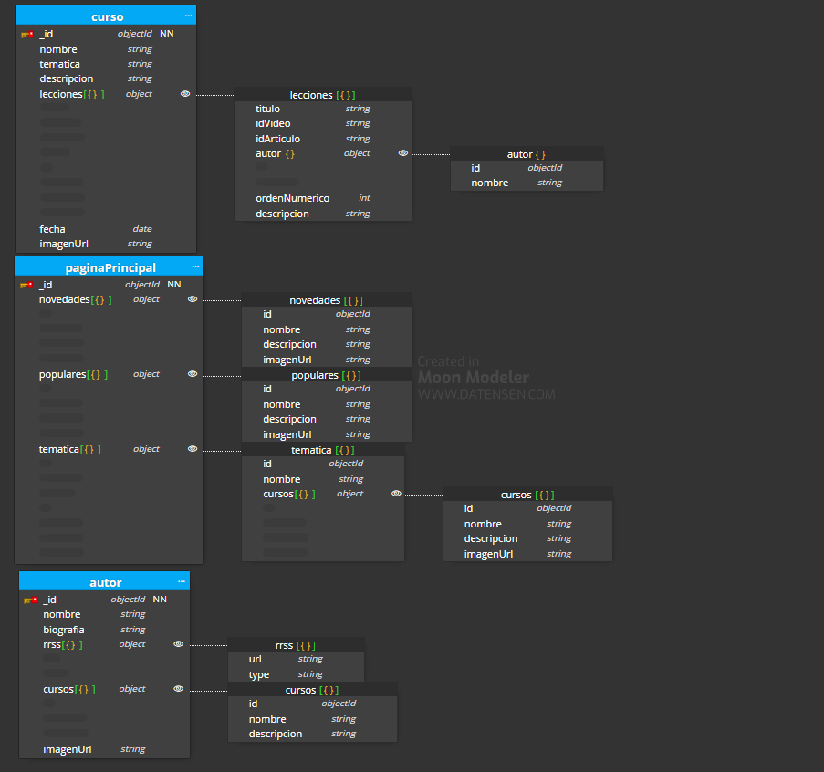

# 01-laboratorio-modelado

## Caso básico

Este es el caso básico

- He creado una colección 'curso' en la que he añadido toda la información que debe contener, creando un array de lecciones debido a que cada curso tiene más de una lección. Dentro del array se indica el titulo de la lección, el id del video, el id del articulo, el autor, el orden numérico y una pequeña descripción. En cuanto al autor, a su vez es un objeto que tiene el id del autor por si alguien quiere acceder a la pagina del autor y su nombre. Para obtener los autores de cada curso, como están dentro de cada lección, se pueden obtener directamente desde ahí.

- También he creado la colección del autor por separado por si alguien quiere consultar su información, ahí aparecerá el nombre, la biografia, la imagen, las redes sociales como un array de un objeto que tiene url y el tipo de red social, y los cursos como un array de objeto que tiene el id del curso por si se quiere acceder, el nombre y la descripción.

- He creado la página principal actualizar las novedades, populares y temáticas de los cursos, aunque se podría hacer a nivel de caché. En novedades se encontrará un id por si se quiere acceder a cada una, un nombre, descripción y una imagen, al igual que en populares. En temática también aparece un id, un nombre y un array de objeto de cursos, donde se encuentra el id, nombre, descripcion e imagen.

