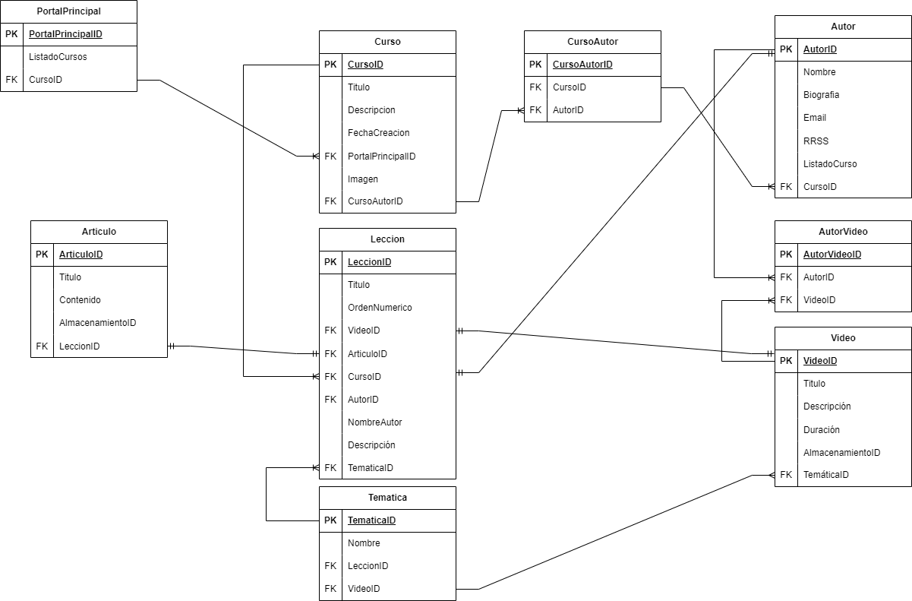

# 05-laboratorio-modelado-relacional

## Caso básico

## 1. Explicación del Modelado

Se identificaron las siguientes entidades principales:

- **Autor**: Representa a los creadores del contenido (videos, artículos).
- **Curso**: Es la unidad central del sistema, compuesta por lecciones que pueden ser videos o artículos.
- **Lección**: Cada curso está compuesto por lecciones que pueden ser videos o artículos, vinculando cada lección a un curso.
- **Video**: Representa los contenidos audiovisuales, cada uno tiene un autor y una única temática.
- **Artículo**: Representa los textos o documentos asociados al curso.
- **Temática**: Define la categoría de cada video.

## 2. Patrones Aplicados

### 1. Patrón Entidad-Relación (ER)
- En este modelo, el patrón ER fue clave para identificar las relaciones entre **Curso**, **Lección**, **Autor**, **Video**, y **Temática**.
- La relación **1:N** entre **Curso** y **Autor** se maneja a través de una tabla de unión (`CursoAutor`), lo que permite flexibilidad para que múltiples autores puedan colaborar en un curso. Al igual que se ha implementado la tabla (`AutorVideo`), para facilitar la relación **1:N** en la cual un autor puede tener muchos videos. 
- De forma similar, se implementa una relación **1:N** entre **Video** y **Temática**, ya que un video solo puede tener una temática, pero una temática puede aplicarse a varios videos.
- En el caso de las relaciones entre **Curso** y **Lección**, y entre **Lección** y **Video** o **Artículo**, se aplica el patrón 1:N. Esto significa que un curso puede tener múltiples lecciones, pero cada lección pertenece a un único curso. Lo mismo se aplica entre lecciones y sus respectivos videos/artículos.

### 2. Patrón de Normalización
- El modelo sigue los principios de normalización (hasta la 3ª Forma Normal), minimizando la duplicación de datos. Por ejemplo, la separación entre **Autor**, **Curso**, y **Lección** asegura que no haya redundancia de información sobre autores o cursos en varias tablas.

